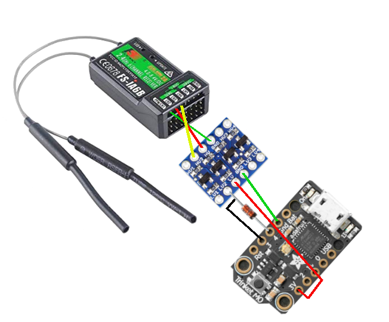

# circuitpython-ibus
CircuitPython implementation of ibus protocol for Flysky i6x

Based on and inspired by [bmellink/IBusBM](https://github.com/bmellink/IBusBM)

The ibus module contains an IBUS class that needs a UART connected to a receiver that supports FlySky IBUS.

Support for both telemetry and servo has been implemented.

It was tested using a Adafruit Trinket M0 running Circuit Python 4.1 connected to a TGY-IA6B receiver.

To connect the Trinket M0 to the receiver, I followed the instructions from [bmellink/IBusBM](https://github.com/bmellink/IBusBM).

The advantage of the Trinket M0 is that it has a hardware UART and debug info via the USB.

I used the following components:
* [Logic level shifter 5V to 3.3V](https://www.sparkfun.com/products/12009)
* Diode 1N4148

Connections are to either the sens port OR the servo port.

For example the following diagram shows how connections are made to the SENS port on the receiver:

